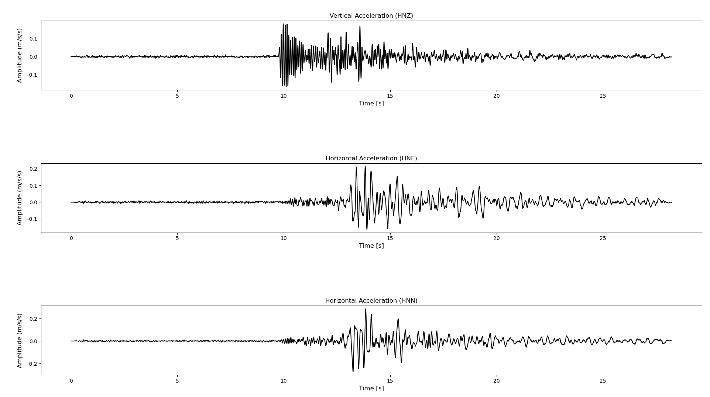
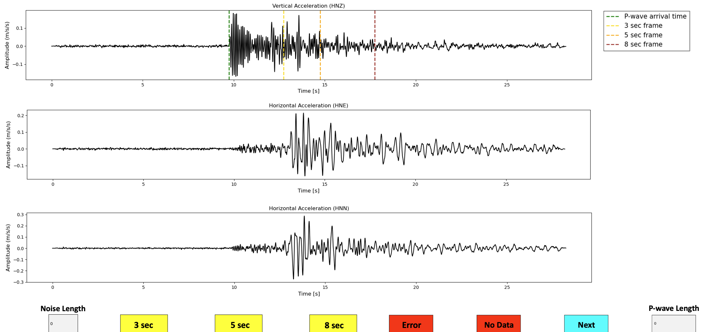
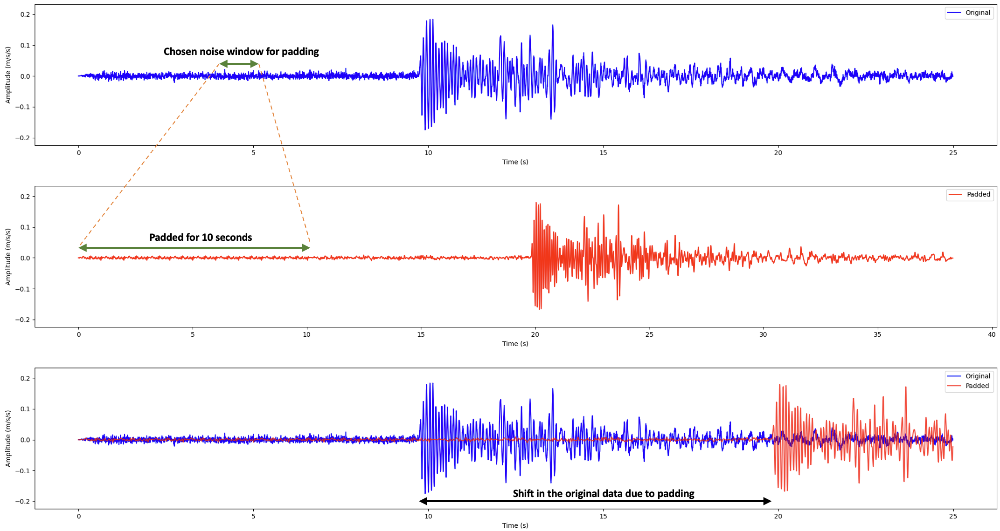

# Manual Pick Tool for P-Wave Detection
## Overview
The Manual Pick Tool is specifically designed to support the evaluation of P-wave detection algorithms by enabling precise manual picking of P-wave arrival times, calculation of Peak Ground Acceleration (PGA), and padding of noise data for comprehensive processing. This tool is integral to our research efforts in improving the accuracy and reliability of Earthquake Early Warning Systems (EEWS).

## Features
  1. Picking P-Wave Arrival Time: This step ensures precise identification of P-wave arrival times from the earthquake data, allowing for accurate comparison with algorithm-detected times.
  2. Calculation of PGA for P-waves: This allows the reliable calculation of Peak Ground Acceleration (PGA) values from manually picked P-wave data.
  3. Padding Noise Data for Processing: Including noise data addresses gaps in continuous earthquake data. This is useful for increasing earthquake data length, making processing different P-wave detection algorithms easy.

## Detailed Description 
### Feature 1 - Picking P-Wave Arrival Time
#### a. Waveform Inspection:
&emsp; The tool displays acceleration recordings for each earthquake across three directional axes.

#### b. P-wave Marking:
&emsp; If the P-wave start is clear, the user can select the starting point by zooming in on the waveform's vertical acceleration recording or without zooming (Figure 1). 

#### c. Amplitude Calculation:
&emsp; Once the P-wave start is identified, the tool calculates the initial amplitude by averaging the vertical acceleration values over 1 second starting from the marked P-wave onset.

#### d. Data Logging:
&emsp;  The P-wave arrival time and calculated amplitude are automatically recorded in an Excel sheet

#### Visualisation of the tool's P-wave picking window

  
   
  <em>Figure 1: Tool's First Window for P-wave picking</em>

### Feature 2 - Calculation of PGA for P-waves
#### a. Time Window Selection:
&emsp; After identifying the P-wave's start, the tool provides options to select preset time windows of 3, 5, and 8 seconds, facilitating the encapsulation of the entire P-wave. These options are accessible via yellow buttons on the tool's interface, as depicted in Figure 2.
&emsp;  For users with specific requirements, a textbox at the bottom right-hand corner of the interface allows them to enter custom time window lengths (see Figure 2, labelled 'P-wave Length').

#### b. Time Window Selection:
&emsp; Upon setting the time window, whether preset or custom, the tool calculates the PGA based on the maximum vertical acceleration recorded within the selected timeframe.

#### c. Data Logging:
&emsp; All calculated values, including the PGA and the selected time window, are automatically recorded in the same Excel sheet used in Feature 1.

#### Visualisation of the tool's PGA calculation window

  
   
  <em>Figure 2: Tool's Second Window for PGA Calculation</em>

### Feature 3 - Padding Noise Data for Processing
#### a. Selecting Noise Segment:
&emsp; Users can specify a noise duration (e.g., 1-2 seconds) that they wish to replicate for padding purposes. This is done via a textbox at the bottom left-hand side of the interface, marked in Figure 2 as 'Noise Length'.

#### b. Padding Process:
&emsp; The selected noise segment is automatically replicated to fulfil the required 10-second noise data benchmark. This padding technique extends the original noise data by copying the chosen segment, creating a dataset with an extended pre-event noise period.

#### b. Data Adjustment:
&emsp; The original seismic data is adjusted with the extended noise data, which shifts the dataset to provide a better baseline for the P-wave detection algorithms. The adjusted data is saved in the "Data_File/Expanded_Data/" directory in MiniSEED format.

Figure 3 visually demonstrates the padding process. It shows how a one-second noise window, selected from between 4 and 5 seconds of the original data, is replicated to extend the recording by 10 seconds.

#### Visualisation of the tool's padding process

  
   
  <em>Figure 3: Original Earthquake data before and after padding </em>

